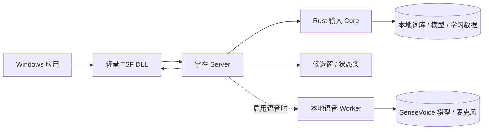

<div align="center">
  
  <h1>字在 Zizai</h1>
  <p><strong>只为 Windows，写给自己用。</strong></p>
  <p>
    从 <a href="https://github.com/qingjian-team/qingjian">青简 Qingjian</a> fork 而来，<br />
    使用 Rust 构建的本地优先拼音输入法。
  </p>

  <p>
    <a href="https://github.com/billowsand/qingjian/actions/workflows/ci.yml"></a>
    
    
    
    <a href="./LICENSE"></a>
  </p>

  <p>
    <a href="#安装">安装</a> ·
    <a href="#为什么是字在">理念</a> ·
    <a href="#现在能做什么">功能</a> ·
    <a href="#隐私边界">隐私</a> ·
    <a href="#开发">开发</a>
  </p>
</div>

---

## 一句话定位

**字在是一个从青简 fork 出来、专注于 Windows 的个人隐私输入法。**

它用 Rust 编写，转换、排序、学习和本地整句模型都在电脑上运行。没有字在账号，没有项目后端，没有遥测，也不会联网检查更新。

更重要的是，它不试图成为一款“每个人都觉得好用”的输入法。字在只做作者自己愿意长期使用的输入法：不需要的能力直接裁剪，不用一层又一层的开关把所有选择留给用户。

> **不做选择，只做适合自己的。**
>
> 如果你也想用这样的输入法，就用。

> [!IMPORTANT]
> 字在仍处于自用测试阶段。行为、按键和功能会继续跟着作者的真实使用习惯变化，而不是围绕功能数量或市场覆盖率增长。

## 看看它

下面展示的是此前确定的“字在”Windows 视觉设计稿，也是图标、配色、候选界面、设置程序与安装体验的设计基准。

### 候选窗与悬浮状态条

<p align="center">
  
</p>

浅色与深色使用同一套语义：钴蓝表示当前选择，薄荷色表示正在输入或本地生效。候选内容永远比品牌装饰更重要。

### Windows 设置界面

<p align="center">
  
</p>

设置程序遵循 Windows 11 的原生结构，品牌只出现在图标、导航、实时预览和关键状态中。它是当前过渡期的收敛工具，而不是项目最终形态。

### 安装与系统集成

<p align="center">
  
</p>

从安装包、开始菜单到任务栏与输入法切换菜单，字在使用同一套图标家族；小尺寸图标单独绘制，不把主图标机械缩小。

<details>
<summary><strong>查看品牌图标系统</strong></summary>

<p align="center">
  
</p>

</details>

## 为什么是字在

### 字在本机，表达自在

“字在”首先描述一件具体的事：你的文字、选择习惯和个人数据留在自己的电脑里。

它也与“自在”同音。输入法应该足够快、足够安静，最后退到思考之后，而不是要求用户围着它工作。

### 个人定制，不是大众产品

大多数软件把差异变成设置：多一个需求，就多一个开关；开关越来越多，再把取舍交还给用户。

字在选择另一条路：

1. **作者先用。** 只有作者愿意每天使用的行为，才有理由留在产品里。
2. **以删代选。** 作者不需要的功能优先删除，而不是增加“是否启用”的选项。
3. **代码就是定制。** 当偏好真的不同，修改代码比继续扩张设置页更诚实。
4. **保持单一答案。** 每个问题尽量只有一种经过实际使用验证的处理方式。

这不是在设置中取舍，而是最终没有设置。

> [!NOTE]
> “没有设置”是项目的最终目标，不是假装已经完成。当前版本仍保留过渡期设置程序，用于验证行为、迁移配置和收敛作者偏好；随着这些决定稳定，运行时选项会逐步被固定实现替代。

### 无设置路线

- [x] 从跨平台上游分出 Windows 专版
- [x] 建立独立名称、图标、配色、安装包和 Windows 交互
- [ ] 继续删除作者不使用的模式与兼容分支
- [ ] 将必要定制收回源码和构建阶段
- [ ] 移除面向运行时取舍的设置界面

## 与青简的关系

字在 fork 自 [青简 Qingjian](https://github.com/qingjian-team/qingjian)，继承了它以 Rust 编写的平台无关输入核心、词库格式、本地学习和整句模型。这些扎实的基础让本项目可以把精力集中在 Windows 上。

从 fork 开始，两者选择了不同方向：

| | 青简 | 字在 |
| --- | --- | --- |
| 产品方向 | 跨平台输入与语言学习 | Windows 个人输入体验 |
| 设计对象 | 面向更多用户与使用方式 | 面向作者自己的长期使用 |
| 定制方式 | 产品配置 | 逐步收敛到代码与构建 |
| Windows | 支持的平台之一 | 唯一发行目标 |

字在不是青简的官方 Windows 发行版。感谢青简及其贡献者完成的原始设计与工程积累；上游版权与许可证继续按原项目约定保留。

## 现在能做什么

| 能力 | 当前实现 |
| --- | --- |
| 中文输入 | 全拼、简拼、整句输入与拼写纠错 |
| 本地整句 | 本机小模型重排候选，不依赖在线服务 |
| 输入方案 | 小鹤、自然码、微软、搜狗双拼，以及小鹤辅码 |
| 中英切换 | `Shift` 或 `Caps Lock` 切换；英文模式直接输入 |
| 本地学习 | 词频、用户词、上下文接续与纠错记录只写本机 |
| Windows 集成 | TSF 文本服务、32/64 位应用、悬浮状态条和原生安装包 |
| 自绘界面 | 钴蓝与薄荷品牌主题，浅色 / 深色一致，候选固定横向排布 |

> [!TIP]
> 功能表描述的是当前版本，不是“承诺永远保留”的清单。真实使用证明没有价值的功能，会被直接删掉。

## 隐私边界

输入法能看到你敲下的几乎每一个字，因此字在默认把边界画得很简单：**能不离开电脑，就不离开电脑。**

- **转换在本机。** 拼音切分、词库查询、整句转换、候选排序和学习记录都由本地 Rust 代码完成。
- **没有字在服务器。** 项目没有账号、遥测、崩溃上报或远程配置服务。
- **私密输入框不参与。** 密码框和应用声明为私密的输入区域不联想、不记录、不学习。
- **数据可核对。** 配置、学习数据与日志都在本机目录，格式与读写代码全部开源。
- **不联网。** 代码里没有云端联想、在线更新检查这一类请求，断网与联网的行为完全一致。

详细边界见 [数据与日志](./docs/user/help/data-and-logs.md)。安全问题请按 [SECURITY.md](./SECURITY.md) 私下报告。

## 为什么用 Rust

高效不是把“快”写在介绍里，而是让结构本身足够简单：

- 原生编译，没有常驻解释器或 Web 运行时；
- 词库使用可内存映射的二进制格式，避免启动时解析整份文本；
- TSF DLL 保持轻量，输入引擎运行在独立 Server 进程；
- Core 与 Windows 接口分离，输入逻辑可以独立测试；
- Rust 的所有权与类型系统减少常驻输入法最难排查的内存与并发错误。



平台壳只接收 Windows 输入事件并展示结果；拼音、候选、排序和学习都留在 Core。更多设计见 [架构文档](./docs/design/architecture.md)。

## 安装

**系统要求：** 64 位 Windows 10 1809 或更新版本，或 Windows 11。

1. 从 [GitHub Releases](https://github.com/billowsand/qingjian/releases) 下载最新的 `Zizai-*-Setup.exe`。
2. 运行安装包并允许管理员权限；安装器会同时注册 32 位和 64 位 TSF。
3. 在 Windows 输入法列表中选择“字在”。已打开的应用如果仍看不到它，重新打开应用或注销一次。

目前公开产物仍属于测试版，未使用正式代码签名时 Windows 可能显示安全提醒。安装、升级和卸载说明见 [用户文档](./docs/user/getting-started/install.md)。

## 开发

仓库固定使用 Rust `1.96.0`。Windows 端需要 MSVC 工具链；生成安装包还需要 Inno Setup 7.1.0。

```powershell
# 编译整个 workspace
cargo build

# 运行测试与静态检查
cargo test
cargo clippy --all-targets -- -D warnings

# 生成 Windows 安装包
powershell -ExecutionPolicy Bypass -File apps\windows\installer\build.ps1
```

开始修改前请阅读 [开发约定](./docs/contributing.md)、[文档索引](./docs/README.md) 与 [Windows 实现说明](./apps/windows/README.md)。

字在欢迎能够让作者实际输入体验更好的修复、性能改进和简化。若你的偏好不同，也非常欢迎 fork：这个项目相信，个人输入法最自然的定制界面就是代码本身。

## 项目状态

**测试版 · 自用中。** API、目录、按键与功能边界都可能继续变化。当前优先级是每天真实使用、发现摩擦、删除多余设计，而不是扩大功能面。

- [路线图](./docs/plan/roadmap.md)
- [当前待办](./docs/plan/todo.md)
- [更新记录](./CHANGELOG.md)
- [提交问题](https://github.com/billowsand/qingjian/issues)

## 许可与致谢

代码以 [GPL-3.0-or-later](./LICENSE) 发布。随包词库、语言模型、emoji 与英文词表遵循各自来源的许可证，详见 [数据来源清单](./docs/design/landscape.md)。

“字在”名称与 logo 不在 GPL 授权范围内。代码可以依许可证自由使用、修改和分发；制作自己的个人版本时，请使用自己的名称与标识。

特别感谢 [青简 Qingjian](https://github.com/qingjian-team/qingjian) 及其贡献者。没有上游长期积累的 Core、词库工具和跨平台架构，就不会有这个专注 Windows 的 fork。

---

<div align="center">
  
  <p><strong>字在本机，表达自在。</strong></p>
  <p><sub>不做选择，只做适合自己的。</sub></p>
</div>
